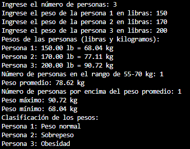

# Registro de Peso 🏋️
## Descripción ⚖️
Este programa en Python permite registrar y analizar el peso de un grupo de personas, este solicita la cantidad de personas y sus pesos en libras, proporcionando cálculos como el peso promedio, máximo y mínimo, así como la clasificación de cada persona según su peso

## Características 🌟
- Verifica la validez del número de personas y los pesos ingresados ✅
- Realiza cálculos de peso total, promedio, máximo y mínimo en kilogramos 🔢
- Clasifica a los individuos en categorías: bajo peso, peso normal, sobrepeso y obesidad 🏷️
- Presenta los resultados de manera clara y organizada 📊

## Funcionalidades 🚀
- Solicita el número de personas 📏
- Solicita y valida el peso de cada persona en libras 📏
- Calcula el peso total, promedio, máximo y mínimo 📐
- Clasifica a cada persona según su peso 🔵
- Muestra los resultados y clasificaciones en pantalla 🖥️

## Requisitos 📋
- Python 3.x 🐍
- Entorno de desarrollo compatible (IDLE, PyCharm, VSCode, etc.) 💻
- No se requieren librerías externas 🚫📦

## Cómo Ejecutar el Programa 💡
- **Instala Python:** 📥 Asegúrate de que Python esté instalado en tu sistema. Puedes descargarlo desde [python.org](https://www.python.org/)
- **Descarga el Repositorio:** 📂 Clona o descarga este repositorio en tu computadora. `git clone https://github.com/KevinSisDl/RegistroPesos.git`
- **Ejecuta el Programa:** 🖥️ Abre tu terminal o entorno de desarrollo y ejecuta el archivo `calculo_pesos.py` 
- **Sigue las Instrucciones:** 📋 Una vez que el programa esté en marcha, sigue las indicaciones en pantalla para ingresar los datos 

## Documentación 📚
- **[Análisis del problema](docs/Análisis%20calculoPesos.pdf)**: 📊 Este documento detalla el análisis de un programa que gestiona el registro de pesos, convierte unidades y calcula estadísticas, incluyendo clasificaciones
- **[Procesos del problema](docs/Algoritmo%20calculoPesos.pdf)**: 📋 Este documento detalla las variables de entrada y salida, describe los pasos a seguir en el programa para gestionar el registro y clasificación de pesos
- **[Pseudocódigo](docs/calculoPesos.psc)**: 📜 Este pseudocódigo en Pseint es una implementación del documento "Procesos del problema" y detalla el funcionamiento para registrar pesos, convertir unidades y calcular estadísticas
- **[Diagrama de flujo](docs/Diagrama%20de%20flujo%20calculoPesos.pdf)**: 🌀 El diagrama de flujo es una representación visual que muestra el proceso para gestionar los pesos de las personas, incluyendo las entradas, procesos y clasificaciones
- **[Código Python](calculo_pesos.py)**: 🐍 Este código Python implementa el programa para registrar y gestionar los pesos de las personas, realizando conversiones, cálculos estadísticos y clasificaciones según los valores ingresados

## Uso 📊
- Ingresa el número de personas cuando se te solicite 📏
- Solicita y valida el peso de cada persona en libras 📏
- Observa los resultados de los cálculos y clasificaciones mostrados en pantalla 👀

**Ejemplo de uso:** 
- Número de personas: 3
- Pesos ingresados: 
    - Persona 1: 150 lb
    - Persona 2: 170 lb
    - Persona 3: 200 lb
- Resultado:
